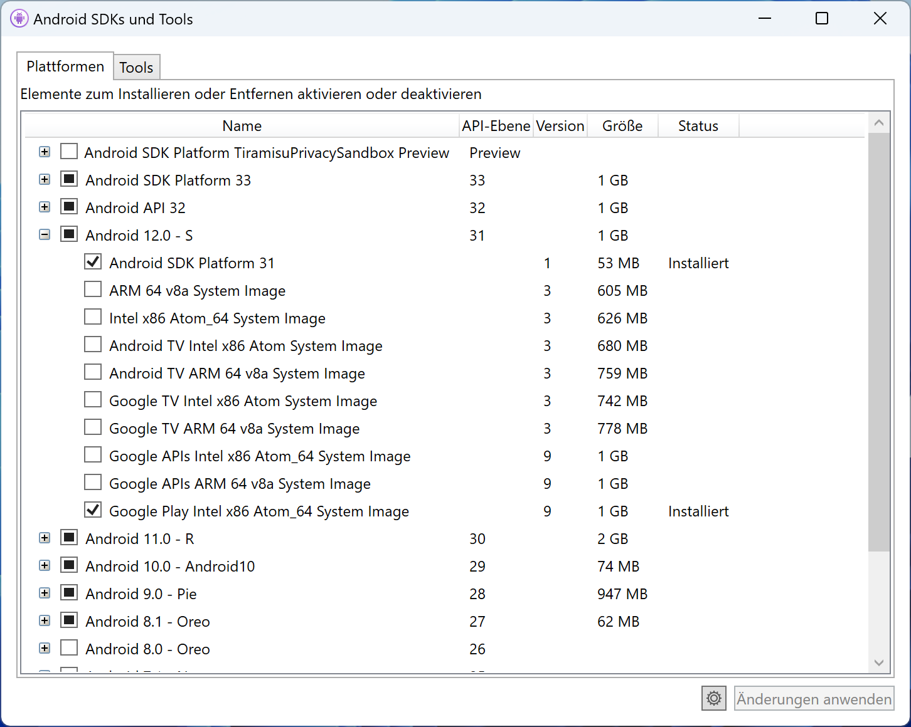

# Codebeispiele zum Buch "Cross-Plattform-Apps mit .NET MAUI entwickeln"
In diesem Repository finden Sie die Codebeispiele zu meinem Buch 
"[Cross-Plattform-Apps mit .NET MAUI entwickeln](https://www.hanser-kundencenter.de/fachbuch/artikel/9783446472617)" (ISBN: 
978-3-446-47261-7), erschienen im Dezember 2022 beim Carl Hanser Verlag.


Dieses Buch verfolgt zwei Strategien für die Codebeispiele. In jedem Kapitel-Ordner gibt es Unterordner, die auf dem Wort Demo enden. In diesen Unterordnern finden Sie die Beispielcodes zu den Listings der entsprechenden Kapitel.

Ab Kapitel 9 gibt es außerdem in den meisten Kapitel-Ordnern den Unterordner `ElVegetarianoFurio`. Dabei handelt es sich um den Quellcode der Beispiel-App, die wir Schritt für Schritt in diesem Buch entwickeln werden. Der Quellcode der Beispiel-App in den jeweiligen Kapitelordnern entspricht dem Fortschritt zum Ende des Kapitels.

Inhalt der Beispiel-App ist die Umsetzung einer Speisekarten-App für das fiktive vegetarische, spanische Restaurant *El Vegetariano Furio* (zu Deutsch: Der wütende Vegetarier).


## Beispiele für .NET 6 und .NET 7

Die Beispiele für dieses Buch wurden ursprünglich für .NET 6 geschrieben. Kurz vor der Veröffentlichung des Buchs kam .NET 7 heraus. Da .NET 7 einige Verbesserungen für .NET MAUI gebracht hat, habe ich mich dazu entschieden, die Beispiele im main-branch auf .NET 7 zu aktualisieren. Um diese Beispiele ausführen zu können, benötigen Sie Visual Studio 2022, Update 17.4 oder höher.

Im Branch net-6 finden Sie die ursprünglichen .NET 6 Beispiele. Zur Ausführung dieser Beispiele benötigen Sie Visual Studio 2022 Update 17.3 oder höher.

## Fehler, Korrekturen und Kontakt.
Korrekturen zu fachlichen Fehlern im Buch sowie Rechtschreibkorrekturen finden Sie auf der Webseite zu diesem Buch, die Sie unter https://www.andrekraemer.de/maui-buch erreichen.

Eventuelle Fehler in den Codebeispielen werde ich kontinuierlich auf diesem GitHub-Repository korrigieren. 
Wenn Sie in den Beispielen einen Fehler finden sollten, der noch nicht korrigiert ist, dann lade ich Sie herzlich dazu ein, einen Issue über das GitHub-Repository anzulegen.

Scheuen Sie sich nicht, mich bei Fragen oder Anmerkungen zum Buch direkt per E-Mail unter andre@andrekraemer.de oder auf Twitter unter https://twitter.com/codemurai anzuschreiben.
Bitte haben Sie aber Verständnis dafür, dass ich unter der E-Mail-Adresse nur Fragen, die sich direkt auf den Inhalt des Buchs beziehen, beantworten kann.
Darüber hinausgehende Fragen kläre ich jedoch gerne in Schulungen und Workshops, die Sie auch unter dieser E-Mail-Adresse anfragen können.

## Links

- [Kostenlose Leseprobe herunterladen](https://files.hanser.de/Files/Article/ARTK_LPR_9783446472617_0001.pdf)
- [Buch bei Hanser-Fachbuch bestellen](https://www.hanser-kundencenter.de/fachbuch/artikel/9783446472617)
- [Buch bei Amazon.de bestellen](https://www.amazon.de/Cross-Plattform-Apps-NET-MAUI-entwickeln-programmieren/dp/3446472614/)
- [Webseite des Autors zum Buch](https://www.andrekraemer.de/maui-buch)

## Troubleshooting

### Fehler: Could not find android.jar for API level
Falls Sie beim Kompilieren der Beispiele folgenden Fehler erhalten, fehlt bei Ihnen das entsprechende Android-SDK:

```
Could not find android.jar for API level 31. This means the Android SDK platform for API level 31 is not installed. Either install it in the Android SDK Manager (Tools > Android > Android SDK Manager...), or change the Xamarin.Android project to target an API version that is installed. (C:\Program Files (x86)\Android\android-sdk\platforms\android-31\android.jar missing.)
```

Zur Fehlerbehebung müssen Sie lediglich das fehlende Android-SDK nachinstallieren. Öffnen Sie dazu in Visual Studio den *Android-SDK-Manager* im Menü *Extras | Android*

